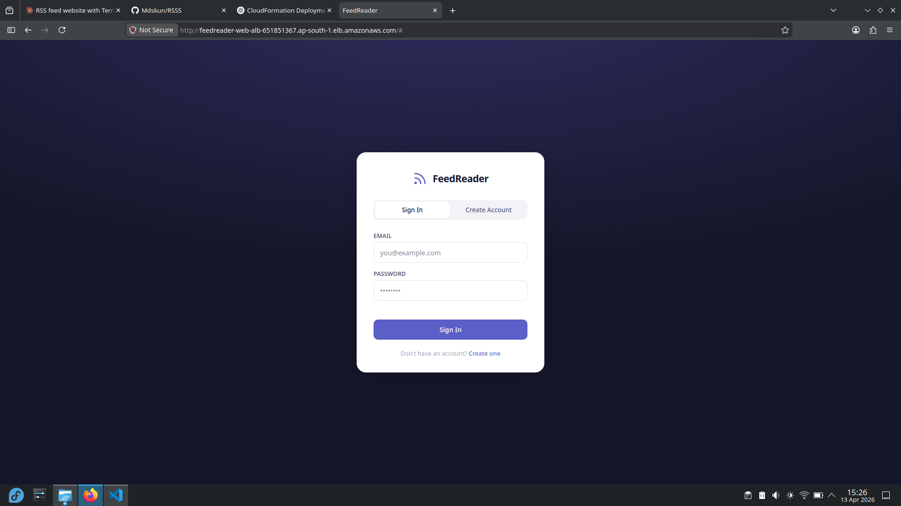
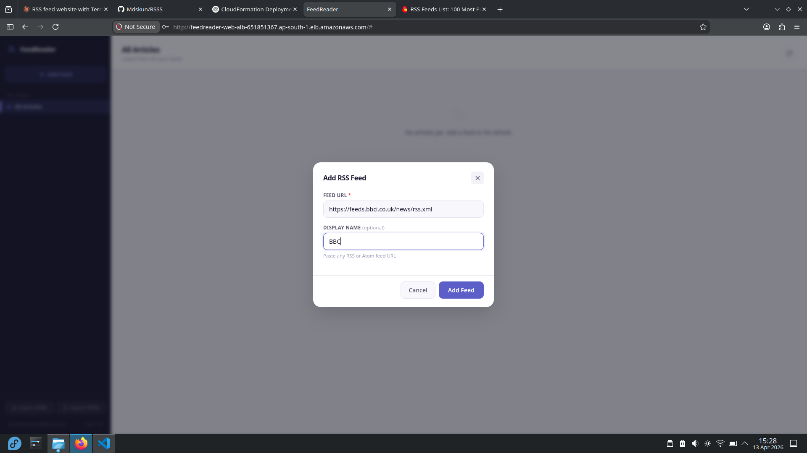
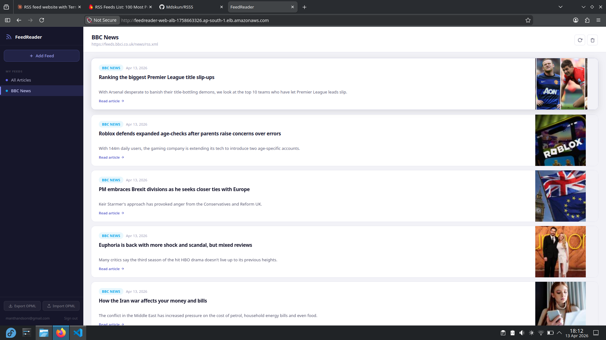

<div align="center">

# 📡 FeedReader

</div>

<p align="center">
  <b>A self-hosted, cloud-native RSS platform built for scale, performance, and full ownership.</b>
</p>

<p align="center">
  Aggregate, personalize, and control your news — powered by a production-grade 3-tier architecture.
</p>

<p align="center">
  
  
  
  
</p>

<p align="center">
  🚀 Full Stack • ☁️ Cloud Native • 🏗️ DevOps Ready • 🔐 Multi-User
</p>

---

## 📚 Table of Contents

* [Overview](#-overview)
* [Features](#-features)
* [Screenshots / Demo](#-screenshots--demo)
* [Configuration](#-configuration)
* [Tech Stack](#-tech-stack)
* [Requirements](#-requirements)
* [Installation / Setup](#-installation--setup)
* [Working](#-working)
* [Project Structure](#-project-structure)
* [Documentation](#-documentation)
* [Contribution](#-contribution)
* [License](#-license)
* [Author & Credits](#-author--credits)

---

## 🧠 Overview

**FeedReader** is a **self-hosted, multi-user RSS aggregation platform** designed with a **production-grade architecture**.

### 💡 Problem

Modern RSS tools:

* Limit customization
* Lock users into ecosystems
* Lack scalability and control

### ✅ Solution

FeedReader provides:

* Full ownership of your data
* Cloud-native scalability
* Developer-friendly extensibility

### 👥 Who is it for?

* Developers building full-stack/cloud portfolios
* DevOps engineers learning infra automation
* Power users who want control over content feeds

---

## ✨ Features

* 🧩 **Universal Feed Support** — Subscribe to any RSS/Atom feed instantly
* 👤 **Multi-User Isolation** — Secure, independent user environments
* 📰 **Offline Article Storage** — Never lose access to saved content
* 🖼️ **Auto Thumbnail Extraction** — Clean, modern reading UI
* 📦 **OPML Import/Export** — Seamless migration between platforms
* ⚡ **High Availability Architecture** — Load-balanced & scalable
* ☁️ **Cloud Monitoring** — Integrated alerts for system health
* 🐳 **Dockerized Deployment** — Consistent dev & production environments

---

## 📸 Screenshots / Demo

<p>
  
  
  
  
</p>

---

## ⚙️ Configuration

| Environment | Description                           |
| ----------- | ------------------------------------- |
| Development | Local Docker-based setup              |
| Staging     | AWS EC2 with Terraform                |
| Production  | Fully automated infra with monitoring |

### 🔐 Environment Variables

| Variable   | Description           |
| ---------- | --------------------- |
| DB_HOST    | MySQL host            |
| DB_USER    | Database user         |
| DB_PASS    | Database password     |
| JWT_SECRET | Authentication secret |

---

## 🧰 Tech Stack

| Layer      | Technology        | Purpose                  |
| ---------- | ----------------- | ------------------------ |
| Frontend   | Vanilla JS        | Lightweight UI rendering |
| Backend    | Node.js (Express) | API & business logic     |
| Database   | MySQL             | Persistent storage       |
| Infra      | Terraform         | Infrastructure as Code   |
| Cloud      | AWS               | Scalable hosting         |
| Container  | Docker            | Environment consistency  |
| Monitoring | CloudWatch        | Alerts & metrics         |

---

## 📋 Requirements

* Node.js ≥ 18
* Docker & Docker Compose
* Terraform ≥ 1.0
* AWS CLI configured
* MySQL (local or cloud)

---

## 🚀 Installation / Setup

<p align="center">
  
</p>

### 1️⃣ Clone Repository

```bash
git clone https://github.com/mdskun/feedreader.git
cd feedreader
```

### 2️⃣ Run with Docker

```bash
docker-compose up --build
```

### 3️⃣ Access App

```bash
http://localhost:3000
```

### 4️⃣ Deploy to AWS (Terraform)

```bash
cd terraform
terraform init
terraform apply
```

---

## ⚙️ Working

### 👤 User Flow

1. Register / Login
2. Add RSS feed URL
3. System fetches and parses articles
4. Articles stored in database
5. User reads content via UI

---

### ⚙️ Internal Working

* Backend fetches feeds using cron jobs
* Articles parsed and normalized
* Stored in MySQL with user association
* Frontend renders feeds dynamically
* Load balancer distributes traffic
* Monitoring triggers alerts on anomalies

---

## 🗂️ Project Structure

```
feedreader/
│
├── frontend/        # UI layer
├── backend/         # API & business logic
├── docs             # The related documents
├── screenshots      # The screenshots saved
├── database/        # Schema & migrations
├── terraform/       # Infrastructure code
├── .env.example
├── docker-compose.yml
├── LICENCE
└── README.md
```

### 🔍 Key Modules

* **Feed Parser** → Extracts RSS content
* **Auth System** → User isolation & security
* **Scheduler** → Periodic feed updates
* **Infra Layer** → AWS provisioning

---

## 📚 Documentation

### 🏗️ Architecture

FeedReader follows a **3-Tier Architecture**:

* **Presentation Layer** → Frontend (UI)
* **Application Layer** → Backend APIs
* **Data Layer** → MySQL Database

Includes:

* Load Balancer (ALB)
* Auto Scaling
* VPC with public/private subnets

> viusal refrance is at [ARCHITECTURE](./docs/ARCHITECTURE.md)
---

### 📝 Changelog

| Version | Changes                          |
| ------- | -------------------------------- |
| v1.0.0  | Initial production-ready release |

---

## 🤝 Contribution

Contributions are welcome!

### Steps:

1. Fork the repo
2. Create a feature branch
3. Commit changes
4. Push to branch
5. Open Pull Request

---

## 📄 License

This project is licensed under the **MIT License**.

---

## 👨‍💻 Author & Credits

**Manthan D Soni**

[](https://github.com/mdskun)
[](mailto:manthandsoni@gmail.com)

---

<p align="center">
  Built with precision, scalability, and engineering excellence 🚀
</p>

